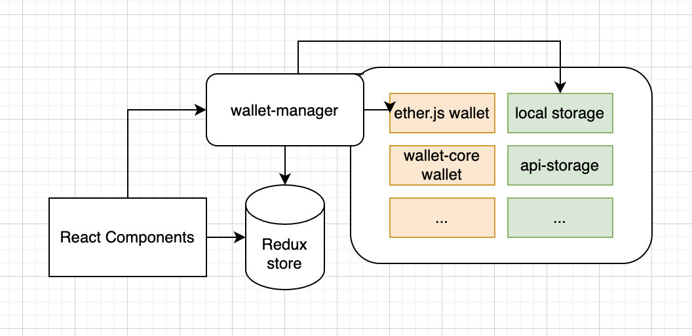

This project was bootstrapped with [Create React App](https://github.com/facebook/create-react-app).

 

### End to End functionality
- [x] Users would like to click a button to generate a Wallet
- [x] Users would like to see a list of generated wallets.
- [x] Users would like to see their private keys by entering their password.
- [x] Users would like to see their balance in testnet networks

### Key points:
- [x] Wallets should be compatible with EVM networks such as **BNB Chain** or **Ethereum**
- [x] You can store the list of wallets in local storage.
- [x] You should NOT store user’s passwords.
- [x] You should NOT store user’s private keys in plaintext.

### Architecture:
There are three main part in app.
- 1. React Components: Ex [App.tsx](./src/App.tsx)
- 2. Application state: Redux is used [store.ts](./src/store/index.ts)
- 3. Wallet Manager: Responsible to encrypt, decrypt, store into storage [wallet-manager.ts](./src/wallet/wallet-manager.ts) - NOTE: idea is we can write new wallet manager with `in-memory`, `server` store & also we can use `ether.js`, `wallet-core` any library to generate wallets. Easy to inject new dependency. 

### Testing Approach:
As there are three main core part of as above we can write case for three way.
- 1. react component: Example [app-component.test.tsx](./src/test/app-component.test.tsx)
- 2. redux store: [redux-store.test.ts](./src/test/redux-store.test.ts)
- 3. wallet manager: [wallet-manager-ether.test.ts](./src/test/wallet-manager-ether.test.ts)
